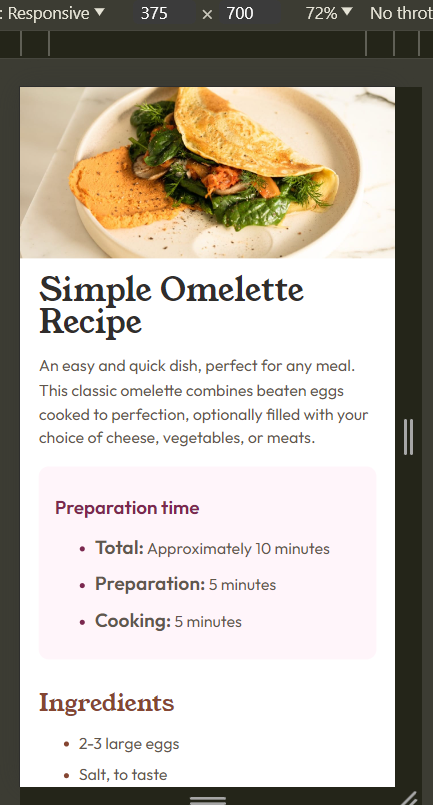
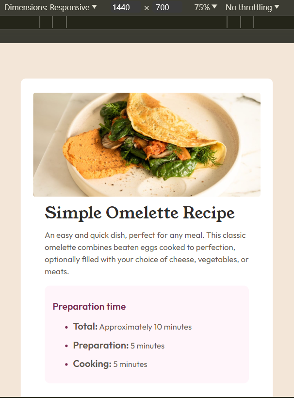

## Table of contents
  - [The challenge](#the-challenge)
  - [Screenshot](#screenshot)
  - [Links](#links)
  - [Built with](#built-with)
  - [Author](#author)

### The challenge
Users should be able to:

- create a responsive layout on both desktop and mobile view

### Screenshot

### Links

- Solution URL: [Add solution URL here]()
- Live Site URL: [Add live site URL here]()

### Built with

- Semantic HTML5 markup
- CSS custom properties

## Author

- Website - [Add your name here](https://www.your-site.com)
- Frontend Mentor - [@Dinesh-36](https://www.frontendmentor.io/profile/Dinesh-36)

